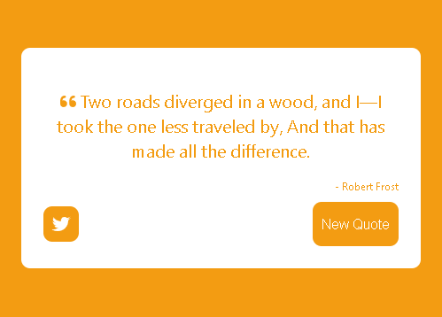

## Introduction
This is a responsive random quote machine created to practice front end development. 
The random quote machine will generate a random quote and change the site color when the "new quote" button is clicked. You may also tweet the current quote by clicking on the "tweet" logo. 

## Skills Applied
- Implemented the random quote generation and the color changing effect with React Hooks
- Fetched the online source using Fetch API 
- Improved the UI with CSS Styles and FontAwesome library
- Applied CSS media query to make the webapp responsive to different screensizes

## Demo

The webapp is deployed on github [here](https://ssharonctw.github.io/random-quote-machine/)

